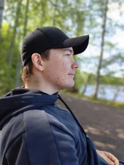

# Jyri Isomäki

**Full Stack -kehittäjä**

Espoo, Suomi  
Puh. 050 466 9666  
[isomjyri@gmail.com](mailto:isomjyri@gmail.com)  
[linkedin.com/in/jmaekki](https://www.linkedin.com/in/jmaekki/)  
[github.com/jmaekki](https://github.com/jmaekki/)

---

## Profiili

Full Stack -kehittäjä, jolla on noin 10 vuoden kokemus web-kehityksestä ja useiden vuosien kokemus yrittäjänä. Vahvinta osaamistani ovat Laravel-pohjaiset web-sovellukset, WordPress sekä SaaS-tuotteiden rakentaminen. Olen rakentanut ratkaisuja pienistä verkkosivuista räätälöityihin web-sovelluksiin ja verkkokauppoihin.

## Tekninen osaaminen

**Backend**

* PHP
* Laravel
* WordPress
* WooCommerce
* REST API:t ja integraatiot
* MySQL / SQL

**Frontend**

* React
* TypeScript
* InertiaJS
* Tailwind CSS
* HTML / CSS / JavaScript

**DevOps & työkalut**

* Linux
* Nginx
* Git / GitHub
* SSH
* DigitalOcean
* Deploy-ympäristöjen pystytys ja ylläpito

**AI**

* Cursor, päivittäinen kehitystyö
* ChatGPT, ideointi, ongelmanratkaisu, sparraus

---

## Työkokemus

### Visiored — Yrittäjä

**04/2024 – nykyhetki**

Rakennan asiakkaille verkkosivuja, verkkokauppoja ja räätälöityjä ohjelmistoratkaisuja. Lisäksi kehitän omia SaaS-tuotteita.

* Räätälöidyt hallintapaneelit, integraatiot ja API-ratkaisut
* Asiakkaiden sivustojen ylläpito ja tekninen tuki
* Suora asiakasviestintä ja osallistuminen asiakastapaamisiin
* Omien SaaS-tuotteiden suunnittelu, kehitys ja julkaisu

**Esimerkkejä asiakasprojekteista:**

* **[Pohjolan Kajo](https://pohjolankajo.com)** – matkailualan yrityksen verkkosivusto.
* **[Villa Senobia](https://villasenobia.fi)** – huonekalujen entisöintiyrityksen verkkosivusto.
* **[Visiored](https://visiored.fi)** – oman yrityksen verkkosivusto.

### RoboGen Oy — Osakas / Tech dude

**08/2020 – 05/2024**

Kolmen henkilön yrityksessä vastasin yrityksen teknisestä kehityksestä ja toteutin asiakkaiden verkkoratkaisuja.

* Asiakkaiden verkkosivustojen ja web-sovellusten suunnittelu ja toteutus
* Olemassa olevien järjestelmien kehitys ja ylläpito
* Asiakkaiden tekninen neuvonta ja suora viestintä

### Geniem Oy — Web-kehittäjä

**01/2018 – 08/2020**

Työskentelin WordPress-kehityksen, ylläpidon ja teknisen tuen parissa. Lisäksi tein pienimuotoista React-kehitystä.

* WordPress-sivustojen kehitys, ylläpito ja jatkokehitys
* Tekninen tuki ja asiakkaiden ongelmien selvittäminen
* Pienimuotoista React-kehitystä osana kehitystiimiä

### Artio Oy — Web-kehittäjä

**04/2017 - 08/2017**

Ensimmäinen web-kehityksen työtehtäväni, jossa työskentelin WordPress- ja Joomla-kehityksen parissa.

* Olemassa olevien verkkopalveluiden jatkokehitys

---

## Projektit

### Testimoon

**Laravel · InertiaJS · React · TypeScript**

Oma SaaS, jonka avulla yritykset voivat kerätä ja esittää asiakassuosituksia verkkosivuillaan.

https://testimoon.com

---

## Koulutus

### Tampereen ammattikorkeakoulu

**Tietotekniikan tutkinto-ohjelma, Ohjelmistotekniikka**
**Valmistunut 2023**

---

## Kielet

**Suomi** — äidinkieli  
**Englanti** — hyvä
